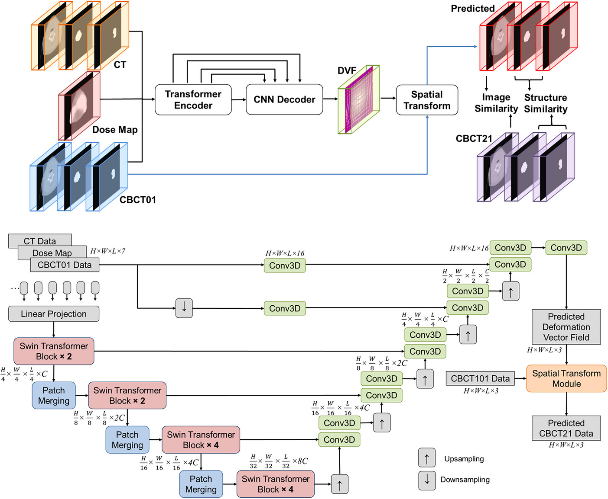

# TransAnaNet: Transformer-based anatomy change prediction network for head and neck cancer radiotherapy

In this project, we constructed a transformer-based model (TransAnaNet) using planning dose map, initial treatment radiological image, and targets’ structures from planning CT and initial CBCT to predict the anatomy change of the treated region in later fractions. The proposed TransAnaNet has demonstrated promising capability in predicting the patient anatomy on later CBCT in the form of a 3D image, which could be valuable to assist in the optimization of the workflow and the use of clinic resources related to ART.

### Keywords
Head and Neck cancer; Adaptive Radiation Therapy; Anatomy Change Prediction; Transformer

### Paper
- *Chen, Meixu, et al. "TransAnaNet: Transformer‐based anatomy change prediction network for head and neck cancer radiotherapy." Medical Physics (2025). DOI: 10.1002/mp.17655* 

In the shared folder, we provided all our codes for this project, from data preprocessing to data analysis.

## Preprocessing
### Image preprocessing
We did the image preprocessing with JupyterNotebook, the file is saved at *./data_preprocessing*. It contains:
1. Data format transformation
2. Data availablity check
3. Resampling and Cropping

Please note the dataset for this project is not publicly avaiable due to institutional regulation, please contact Dr. Jing Wang *Jing.Wang@UTSouthwestern.edu* for potiential data availability. 

### Model construction
We used the project structure of [Medical Zoo](https://github.com/black0017/MedicalZooPytorch), which is an open-source medical image segmentation library of state of the art 3D deep neural networks in PyTorch.A bunch of data loaders of the most common medical image datasets and a set of 3D image preprocessing and augumentation methods were implemented. Please refer to the orignal repo for more details. The model structure is based on [TransMorph](https://github.com/junyuchen245/TransMorph_Transformer_for_Medical_Image_Registration), a transformer based model for unsupervised deformable image registration, we modified this image registration network into a image prediction network. 

### Data analysis
Matlab based data analysis files saved at *./data_analysis*. The data analysis part including body mask generation, image similarity assessment, structure similarity assessment and generation of the plots presented in the published paper.

